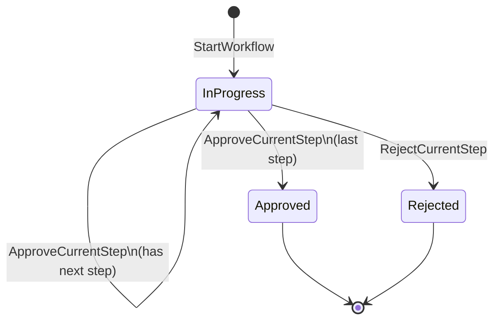

# Approval Workflow State Machine

This document describes the approval workflow state machine used by the ISO DMS domain model.

## States

- `InProgress`: Workflow is active and waiting for decisions.
- `Approved`: All workflow steps are approved.
- `Rejected`: Any step is rejected; workflow ends immediately.

## Events

- `StartWorkflow`: Create workflow and initialize step 1 as pending.
- `ApproveCurrentStep`: Current approver approves the active step.
- `RejectCurrentStep`: Current approver rejects the active step.

## Transition Rules

1. `StartWorkflow` transitions `null -> InProgress`.
2. In `InProgress`, `RejectCurrentStep` always transitions to `Rejected`.
3. In `InProgress`, `ApproveCurrentStep`:
   - advances to next step (remains `InProgress`) if there is another step.
   - transitions to `Approved` if the current step is the last step.
4. `Approved` and `Rejected` are terminal states (no further decisions allowed).

## Mermaid Diagram

## Notes for This Project

- Current implementation uses **2 approval steps**:
  - Step 1: ISO officer
  - Step 2: ISO manager
- A rejection at any step ends the workflow immediately.
- After workflow completion:
  - `Approved` leads document state toward publish flow.
  - `Rejected` leads document state to rejected.
