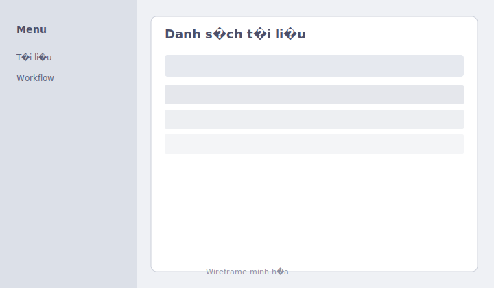

# ISO Documents Management (.NET 8)

Hệ thống quản lý tài liệu ISO theo `Clean Architecture` với backend `ASP.NET Core 8 Web API`.

Mục tiêu chính:
- Quản lý tài liệu và version.
- Workflow phê duyệt nhiều bước.
- Phân quyền theo vai trò (RBAC).
- Tìm kiếm full-text.

## Giao diện (demo)

Các ảnh dưới đây là **wireframe SVG** minh họa bố cục Blazor; bạn có thể thay bằng ảnh chụp màn hình PNG hoặc **GIF** quay nhanh luồng đăng nhập → tài liệu → workflow (đặt tại `docs/screenshots/`, ví dụ `demo-ui.gif`).

| Đăng nhập | Danh sách tài liệu | Workflow |
|-------------|-------------------|----------|
|  |  |  |

**Gợi ý tạo GIF:** Windows (Xbox Game Bar `Win+Alt+R`), ShareX, hoặc OBS — xuất file `docs/screenshots/demo-ui.gif` rồi thêm một dòng markdown `` vào bảng hoặc đoạn dưới đây.

## Kiến trúc ngắn gọn

Project chia 4 tầng:
- `01_Domain`: entity, value object, domain rule, interface.
- `02_Application`: command/query (MediatR), validator, handler.
- `03_Infrastructure`: EF Core, Blob, Elasticsearch, Redis, JWT, DI.
- `04_WebAPI`: middleware, controller, auth, swagger, health check.

Tài liệu tổng quan chi tiết: `ISO_DMS_V3_Architecture.md`

## Công nghệ chính

- `.NET 8`, `ASP.NET Core Web API`
- `MediatR` + `FluentValidation`
- `EF Core 8` + `SQL Server`
- `Azure Blob Storage`
- `Elastic.Clients.Elasticsearch`
- `StackExchange.Redis`
- `JWT Bearer`
- `Serilog`

## Chạy bằng Docker (demo)

Xem **`DOCKER.md`**: `docker compose up --build` (SQL Server + Elasticsearch + API + Blazor).

Hướng dẫn sử dụng tổng quát (Docker + local): **`HUONG_DAN_SU_DUNG.md`**.

## Chạy nhanh local

### 1) Yêu cầu
- .NET SDK 8
- SQL Server (hoặc connection string hợp lệ)
- Redis (tuỳ chọn)
- Elasticsearch (tuỳ chọn)
- Azure Blob account (hoặc cấu hình test)

### 2) Cấu hình

Tham khảo template:
- `src/03_Infrastructure/IsoDoc.Infrastructure/appsettings.template.json`

**Development (local):** file `appsettings.Development.json` **không được commit** (tránh lộ connection string / mật khẩu dev). Hãy sao chép mẫu an toàn:

```bash
copy src\04_WebAPI\IsoDoc.WebAPI\appsettings.Development.json.example src\04_WebAPI\IsoDoc.WebAPI\appsettings.Development.json
```

Sau đó chỉnh `YOUR_DATABASE_NAME`, `YOUR_DEV_PASSWORD`, v.v. trong file vừa tạo.

Điền các section quan trọng trong `src/04_WebAPI/IsoDoc.WebAPI/appsettings.json` (môi trường chung):
- `ConnectionStrings:SqlServer` (nếu không chỉ trong Development)
- `ConnectionStrings:Redis`
- `BlobStorage` / `IsoDoc:AzureBlob`
- `IsoDoc:Elasticsearch`
- `IsoDoc:Jwt`
- `Notifications`

### 3) Build và run

```bash
dotnet build IsoDocumentManagement.sln
dotnet run --project src/04_WebAPI/IsoDoc.WebAPI
```

Swagger:
- `https://localhost:<port>/swagger`

Health check:
- `https://localhost:<port>/health`

## Luồng request (WebAPI)

Request đi qua middleware theo thứ tự:
1. `ExceptionHandlingMiddleware`
2. `Serilog Request Logging`
3. `UseAuthentication`
4. `UseAuthorization`
5. `MapControllers`

Controller chỉ nhận request và `Mediator.Send(...)` sang Application layer, không chứa business logic nặng.

## Cấu trúc WebAPI hiện tại (Part 4)

- `Program.cs`
- `Extensions/WebApiServiceExtensions.cs`
- `Middleware/ExceptionHandlingMiddleware.cs`
- `Models/ApiResponse.cs`
- `Controllers/DocumentsController.cs`
- `Controllers/OtherControllers.cs` (Workflow, Search, Auth)

## Kiểm thử

```bash
dotnet test src/tests/IsoDoc.Domain.Tests/IsoDoc.Domain.Tests.csproj
dotnet test src/tests/IsoDoc.Infrastructure.Tests/IsoDoc.Infrastructure.Tests.csproj
dotnet test src/tests/IsoDoc.Integration.Tests/IsoDoc.Integration.Tests.csproj
npx --prefix e2e playwright test tests/smoke.spec.ts --config e2e/playwright.config.ts
```

**CI (GitHub Actions):** push/PR lên `main` / `master` / `develop` chạy `dotnet restore/build/test` trên file lọc `IsoDocumentManagement.CI.slnf` (bỏ Maui Android). Xem `.github/workflows/ci.yml`.

## Ghi chú

- Error response dùng `ProblemDetails` (RFC 7807).
- Response thành công dùng `ApiResponse<T>`.
- Migration DB được gọi trong môi trường Development.
- Auth hiện hỗ trợ refresh token rotation + lockout khi login sai nhiều lần.

